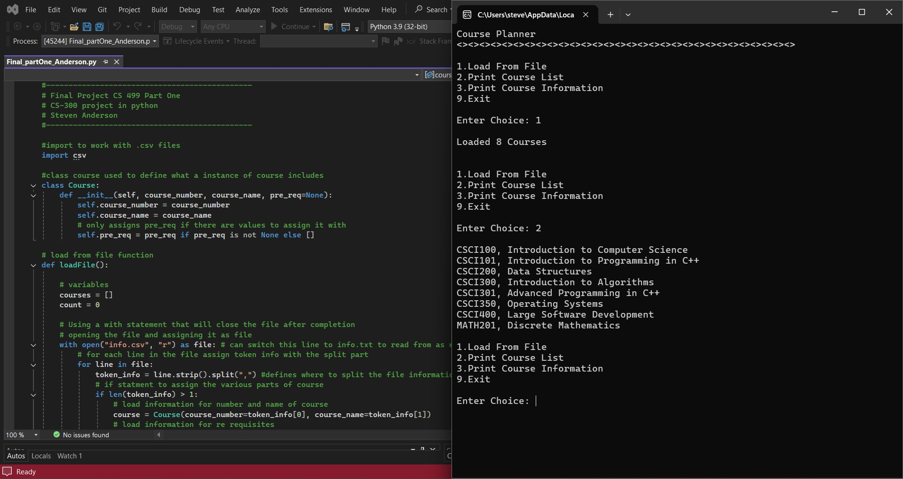
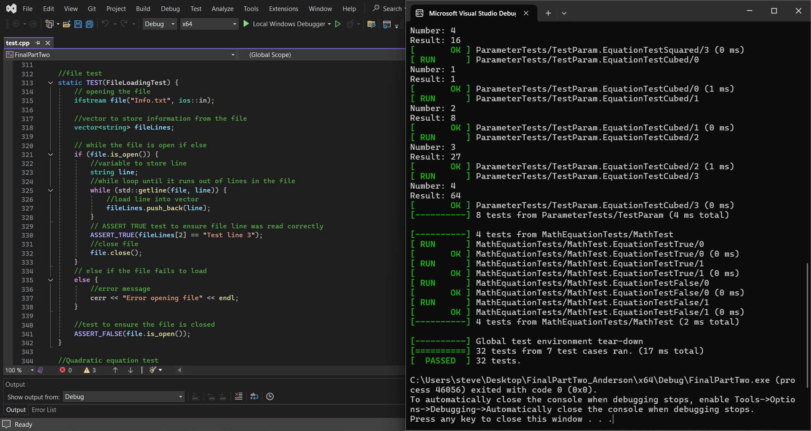
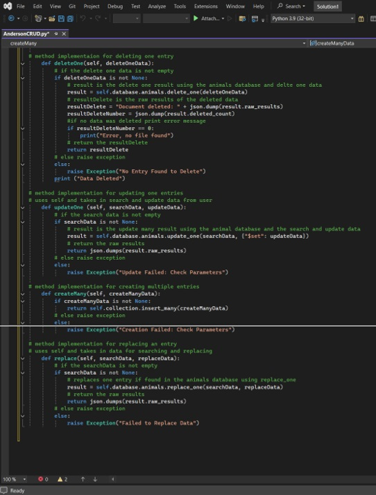

# Hello World!

This is my ePortfolio that showcases some of the knowledge and skills I've gained through the Computer Science program of Southern New Hamphsire University. Thoughout the program I was able to learn many new skills and languages that I can take with me into my future career in computer science development. 

## <u>Table of Contents</u>

&nbsp;[Self-Assessment](#Self-Assessment) 
&nbsp;[Code Review](#Code-Review) 
&nbsp;[First Artifact](#First-Artifact) 
&nbsp;[Second Artifact](#Second-Artifact) 
&nbsp;[Third Artifact](#Third-Artifact) 

## Self-Assessment

My journey in computer science started when I was a kid in middle school and a close friend of mine talked to me about building a website. We spent weeks after that learning all we could absorb about HTML and web development before finally building and running our own simple forum website for geeky topics. That website isn’t around anymore but the facination I developed for computer science has been around ever since. I ended up going to a magnet high school for computers and learned all I could about programming, game development and computer engineering. So when I finally had the opportunity to advance my education I jumped at the opportunity to join the SNHU computer science program. 

I have learned so much since joining the program and worked to polishing any skills I thought I had before. I have worked on becoming a better team member for development teams with a good eye to detail in my code. I have learned more about secure coding then I ever knew before including teqniques and resources to better test my code for security faults or risks. I learned more languages and how they each have their own strong points and how to make them better work with other languages to complete development of unified programs. I also learned how to work with and build a software development cylce plan. How each member of a team can work together with a project plan to keep on schedule and still deploy a working final project at the end. 

My attention to detail and thinking about who will read my program code after me are two invaluable skills I feel my time in this program trained far beyond what they were before. I now reread my code far more and can spot small errors or security flaws in code I didn’t even write or help develop. For my own code this means I have devleoped a very keen eye for what a good secure program should look like and how it should read when read. I also developed the skills needed to work well on a team where others will be working on the same code as me afterword or reviewing my code after I’m done. I add far more comments and focus more on how my code is structured then I did in high school or after. These team collaborative skills are valuable and work well with the skills I learned in a previous construction job where I had to work on team site plans and construction schedules. I was able to adapt that knowledge with all the knowledge I have gained in the program learning about development cycles and project planning. 
  

Many of the courses I took throughout the degree taught me skill I didn’t have before. I learned how to work on a full stack development program, how to work with databases and how to make 3D models from nothing but code. I took courses that challenged me in my understanding of coding and helped me develop new skills in secure coding practices. I know I still have a lot to learn and computer science isnt a field that ends with the degree and my journey of learning isn’t and will never be over. With emerging technologies like A.I. there will always be more to learn and more to help me develop my skills. I also learned it is okay to work with a team and not know everything and rely on those on your team to help me develop new skills or complete tasks that I might have a gap in my knowledge about. But also how to find the right resources to learn the new skills myself and expand my knowledge whenever I can. I plan on taking what I have learned in this program and expanding it with new certifactions like the CompTIA A+, security+ and network+ certifications and into the next degree I get moving forward. 

## Code Review

  First is my code review. In this video I reviewed each of my chosen artifacts before enhancing. In the review I breakdown the design of each project, detailing what each function. I go through the code structure and algorithms. talk about the security of each code, making sure to point out the needed exceptions and error checks in the code. 

[Code Review Link](https://youtu.be/lZIgf2Pzvbk)

## First Artifact

  My first artifact that I enhanced was my program from my CS 300 course. It was a .csv loader program that was written in C++. It loaded a menu for the user for a course planner that included four options. First option is to load from a file the course information. This information is stored for each class by name, number and prerequisite courses. then there are the options for course viewing. One that prints the full course list organized by course number. the second option loads an individual course the user inputs the number for. It prints the course name, number and then lists the prerequisite courses. then there is the final exit option that exits the course planner application. For my enhancement I rewrote the program using Python instead to showcase my ability to skill in design and software engineering by designing the program to work using python script instead of C++ script and enhancing the array storage method. I ended up throwing out the vector usage from the original C++ program and relying on the better array methods present in Python to simplify the code. 

  This artifact enhancement was used to showcase my ability to design and engineering skills. The original artifact was written during my CS 300 course and was focused on creating a program in C++ that could take in either a text or csv file and read the information for the purpose of allowing the user to use it in course planning. In order to showcase my skills in design I redid the program in Python and took advantage of Python’s array organizing to create a shorter and more streamlined program. In the original C++ version, I had to use a vector and additional token array to ensure the program could save the information about each course the right way even when loaded from a .csv file. In Python I was able to avoid having to do this since Python has a import that helps read from .csv files. The strengths of Python with data input allowed me to rewrite the program in Python in far less lines than the original program. The original program was 227 lines of code and the new Python version of the program is only 131. Helping to keep the program simple and have easy to follow logic. I condensed the file reading and assigning function of the program into one loadFile function as opposed to the loadFile and setToken functions of the old program. In my condensed loadFile function I used the Python ‘with’ statement which allowed me to create a statement that opened the file, ran the for loop inside and when done automatically close the file without me needing to add a close command. The other part that allowed me to cut down on so many lines and make a more streamlined design was taking advantage of the Python init constructor. Python allowed me to assign all the different values for the course in their self-instances without the need of the token method I used in C++. I also added very detailed and numerous code comment lines to help anyone reading the program or needing to understand it know exactly what I did and why certain parts are needed in the program. I also made sure that the program is secure by avoiding any left open data storage or variables and made sure to close the file after the program read it to avoid data leaking. 

[Enhancement for CS_300](https://github.com/SA-176/SA-176.github.io/tree/300Enhancement)

## Second Artifact

  My 2nd artifact is my project from my CS 405 class. In this project I had to program a series of unit tests using the Gunit testing environment to run code test on different array changes. For my enhancement I added a series of new tests to showcase my understanding of code structure and algorithms. I added tests to ensure data was hashed after using hasher. I ran a test to verify a quadratic equation and a trigonometric equation. there was also an added test to file loading to ensure the file it was loaded to read the correct data and a test in the same test function to ensure the file was closed by the end of the function. then there were two Test_P classes to test two tests each. and to ensure the data being sent through GET_PARAM is being squared and cubed correctly and the other had a ASSERT_TRUE and an ASSERT_FALSE test attached to it. one to ensure the math came back true and the other to make sure the math in the function failed.

  This artifact was chosen to showcase my ability in algorithms and data structure. I chose my CS 405 project since it focused on unit testing and allowed me to show different algorithms and data structures within their own tests. In multiple tests I used complex mathematical equations to show my understanding of the data structure and algorithmic programming needed to solve the equations within the program. For security I showcased my understanding by using it unit tests which tests all the code in their own functions and make sure everything works as needed without failing their tests. I used the file opening tests to both showcase how a file can be opened and the secure way of opening it by ensure the file is closed after use. 

  Enhancing this artifact taught me a lot more about unit testing. My CS 405 class was one of my more recent courses and the only one that dealt with unit testing and I wasn’t fully comfortable with it so I ended up using resources to learn more about the process of working with unit tests, especially using TEST_P tests. I did though complete all the planned enhancements and even added the additional trigonometric test that wasn’t in the original plan but wanted to work on to utilize more of the cmath. I do believe this artifact showcases my abilities and knowledge of algorithms and data structure since each individual test included its own structure and required various different algorithms to make work. Also, the coding of the actual TEXT_P tests which included building new classes and the INSTATNIATE functions in order to send parameters into the tests is a good example of understanding the data structure that is needed to make these work. I wanted to make sure that in order to showcase my Algorithmic programming skills I showcased a variety of examples and using the unit tests gave me a great chance to highlight each example inside their own test. 

[Enhancement for CS 405](https://github.com/SA-176/SA-176.github.io/tree/405Enhancement)

## Third Artifact

  My third enhancement was on my final project for my CS 340 class which used a MongoDB controlled with a Python CRUD file. For my enhancement I added new commands to the CRUD file to expand the control over the database. I added four new commands to the CRUD file to fill gaps in the original CRUD capabilities. The first was  delete one command since the original delete was used to delete multiple entries if they shared the same information, this new delete one would only delete the first entry in the database that matched the information in the search. the next command was a update command that searches for an entry and replaces data in that entry with new data from the user. The third new command was a create many command. the original command only added one entry to the database per call of the command. the new command adds all entries tied to the call of the command. The fourth new command is a replace command that would search the database for what the user wanted and replace it with the new user input to the database.

  This artifact was chosen to showcase my skills working with databases. I chose my assignment from my CS 340 class where I created a database controller and CRUD file with a dashboard for a fictional rescue animal service. It displayed two charts for the data one of which was a map showing where the dogs where in the area. The part of this project that I enhanced was the CRUD file. The create, read, update and delete file. I added four new commands to the CRUD file which included delete one, create many, replace, and update one. The original commands were to create one, read, update many and delete many. To do this I had to use the various methods available for modifying data in the collection. I also enhanced the commenting on the code since most parts of the previous CRUD commands lacked proper commenting. It also showcased my ability to work with databases using python to create a controller. I used commands in python that I hadn’t used before to create more options for the user to modify the database entries or create and delete entries. This is a key part in database programs since database programs need a control file to interact with the database. MongoDB works particularly well with Python since Python has libraries that work directly with JSON and BSON data formats. And using PyMongo, Python’s driver to work with MongoDB, I was able to write the controls using precise code that didn’t require extra lines make changes in the database. It also was a good way to showcase my ability working with NoSQL databases that store wide arrays of data in a more flexible method. The program stored various information about different animals for adoption and allowed the user to not only add more data entries but also delete or modify entries already present in the database. 

[Ehancement for CS 340](https://github.com/SA-176/SA-176.github.io/tree/340Enhancement))
